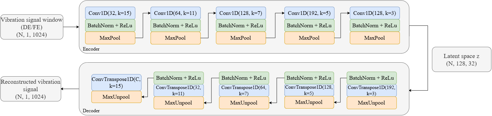
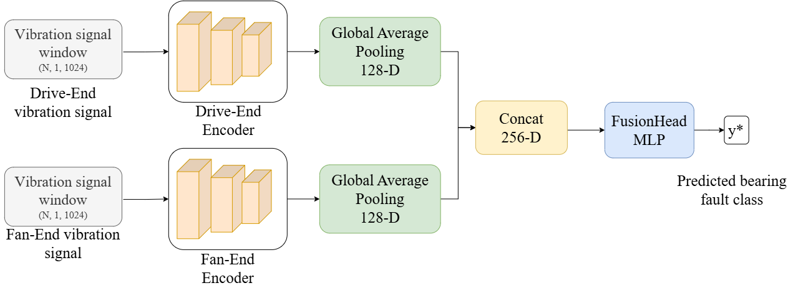
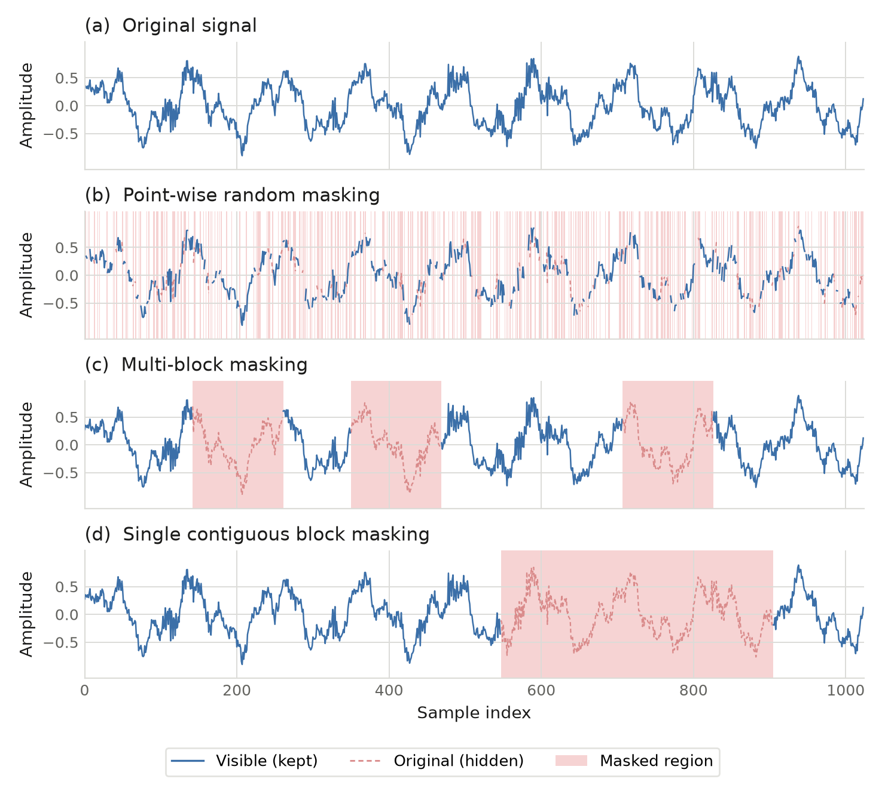

# Few-Shot Cross-Load Bearing Fault Diagnosis

Self-supervised representation learning for rolling-bearing fault diagnosis under
**operating-condition shift** and a **small labelled budget**.

One 1D convolutional autoencoder per sensor channel is pretrained on *unlabelled*
vibration data pooled from all operating conditions with a **hybrid masked +
contrastive** objective. The encoders are then frozen and a small classification
head is trained from as few as **5–20 labelled windows per class**. Accuracy is
reported both on the training load (*same-load*) and on every unseen load
(*cross-load*).

## Background

This project started as a bachelor's thesis at Turkish-German University,
supported by the HAVELSAN SUIT program. An earlier version of the method was
published at SIU ([IEEE Xplore](https://ieeexplore.ieee.org/document/11637089)).
This repository is the current, more advanced version of that work: the hybrid
masked + contrastive pretraining objective, the sensor-expert fusion and the
two cross-load evaluation protocols were all added after the SIU publication.

## Architecture

**Autoencoder backbone** — five convolutional blocks reduce a 1024-sample window
to a `128 × 32` latent map; a mirror decoder reconstructs it through the stored
max-pooling indices. Only the encoder survives pretraining.



**Sensor-expert fusion + few-shot head** — the drive-end and fan-end channels get
their own autoencoder. Each frozen encoder is global-average-pooled to a
128-dimensional embedding, the two are concatenated (256-d) and classified by a
small MLP trained on a handful of labelled windows per class.



**Masking** — every window is corrupted with one of three strategies drawn at
random (isolated points, several short blocks, or one long span), all at the
same 35 % ratio. The block variants are the harder ones: the decoder cannot
interpolate a long gap from its neighbours, so the encoder has to model the
periodic impact structure of the fault.



## Headline results

CWRU, 10 classes, unseen-load accuracy averaged over 3 seeds:

| Protocol | Labels / class | Accuracy |
|---|---|---|
| Leave-one-load-out (literature DG) | 30 | **0.949 ± 0.002** |
| Leave-one-load-out, same total budget | 20 | 0.946 |
| Single-source (strictest) | 20 | 0.822 ± 0.012 |
| Baseline: masked-AE only, single-source | 20 | 0.708 |

Same-load accuracy is ≈0.99 throughout.

**Central finding — diversity beats quantity.** Spreading the *same* 20 labels
per class over three loads instead of one gains **+12.4 points**; tripling the
labels adds only +0.3. Once the head has 10–20 labels per class, domain shift
rather than label count is the bottleneck.

## Method

**Pretraining (`--pretrain`)** — `mae` masked reconstruction, `contrastive`
NT-Xent, or `hybrid` (both). Reconstruction alone must *preserve* load
information in order to rebuild the signal, which is the wrong incentive for
transfer. The contrastive term augments each window twice (amplitude scaling,
noise, circular shift); the two views form a positive pair, every other window
in the batch is a negative, and pulling the pair together forces the encoder to
discard exactly the load-dependent factors it was told to keep. The two
objectives are complementary — empirically `mae < contrastive < hybrid`. The
projection head used by the contrastive term is discarded afterwards.

**Encoder scope (`--scope`)** — `sensor_experts` trains one autoencoder per
accelerometer and concatenates their embeddings; `all_loads` trains a single
shared autoencoder that sees both channels at once. The per-sensor split is
worth about +3 points: the fan-end sensor sits away from the fault and its
content is more load-dependent, so mixing the two channels inside one encoder
lets that nuisance leak into the drive-end representation.

**Cross-load handling** — `--norm instance` standardises every window on its own
statistics and removes the load-dependent amplitude at the input; `--adabn`
re-estimates the encoder's BatchNorm statistics on the target load's *unlabelled
training* pool. Both are training-free and stack for about +9 points.

**Protocols (`--protocol`)** — `single_source` trains the head on one load and
tests on every other one (a 4×4 accuracy matrix); `multi_source` is
leave-one-load-out domain generalisation, and `--ms-label-budget` decides whether
the budget is per source load or shared across the merged pool. Note that
`--adabn` makes an arm transductive (test-time adaptation rather than pure domain
generalisation) and should be reported as such.

**Honest negatives** — the following were implemented, measured and dropped
because they did not beat the defaults on CWRU: expert gating, CORAL/MMD feature
alignment, load-morphing augmentation, self-training on pseudo-labels, test-time
augmentation, a prototypical head, a compact WDCNN encoder, and envelope / FFT /
STFT input representations.

## Layout

```
run_experiment.py      CLI: runs a full experiment and writes a results JSON
train_pipeline.py      splits, normalisation, pretraining, head fitting, AdaBN
models.py              encoder / decoder, autoencoder, embedder, head, baselines
training.py            shared training loops (optimiser, masking, AE, CNN)
data_pipeline.py       CWRU loader (raw CSV -> cached windows)
feature_extraction.py  hand-crafted features for the SVM / XGBoost baselines
analyze_results.py     aggregates result JSONs: mean±std tables + Wilcoxon test
dataset_stats.py       per-load / per-class statistics and distribution figures
```

## Quick start

```bash
pip install -r requirements.txt
```

```bash
# Best configuration: sensor-expert fusion, hybrid pretraining
python run_experiment.py --data-dir data --loads 0 1 2 3 \
    --scope sensor_experts --pretrain hybrid --norm instance --adabn \
    --spc 5 10 20
```

```bash
# Leave-one-load-out, comparable to published domain-generalisation tables
python run_experiment.py --data-dir data --loads 0 1 2 3 \
    --scope sensor_experts --pretrain hybrid --norm instance --adabn \
    --protocol multi_source --spc 10 20
```

```bash
# Data-level statistics: why one load is the hard target
python dataset_stats.py --data-dir data --loads 0 1 2 3
```

```bash
# Aggregate seeds into mean±std tables and run the significance test
python analyze_results.py --dir results --compare hybrid mae --spc 20
```

Add `--baselines` to also train the supervised CNN1D, SVM and XGBoost references
on the same label budget.

## Data

CWRU bearing data, expected as `data/load_{0..3}_all_faults.csv` with columns
`DE_data`, `FE_data`, `fault`: drive-end and fan-end accelerometers at 48 kHz,
10 classes (normal plus inner-race / ball / outer-race faults at three fault
diameters) and four motor loads (0–3 HP), each load treated as one domain.

Signals are cut into non-overlapping 1024-sample windows and cached as `.npz` on
first use; `--window-cache-dir` puts the cache outside the data directory.

The recordings are not redistributed here. They come from the
[Case Western Reserve University Bearing Data Center](https://engineering.case.edu/bearingdatacenter)
and remain subject to that centre's terms.

## Requirements

Python 3.10+ with `torch`, `numpy`, `scipy`, `scikit-learn`, `xgboost` and
`matplotlib`. A GPU speeds up pretraining considerably, but everything runs on
CPU.

## Citation

If this code or the method behind it is useful in your own work, please cite
the paper:

> *Bearing Fault Diagnosis under Small-Sample Conditions Based on Unsupervised
> Representation Learning*, IEEE SIU.
> [ieeexplore.ieee.org/document/11637089](https://ieeexplore.ieee.org/document/11637089)

That paper describes the earlier version of the method; this repository is the
current one, so a pointer back here is welcome alongside the citation.

## License

MIT — see [LICENSE](LICENSE). You are free to use, modify and build on this
code, including commercially, as long as the copyright notice is kept.
